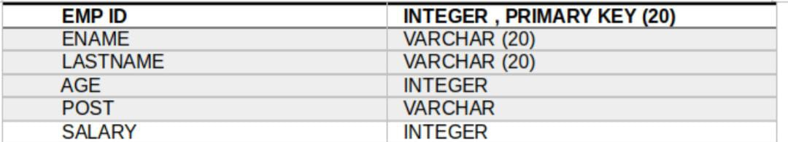
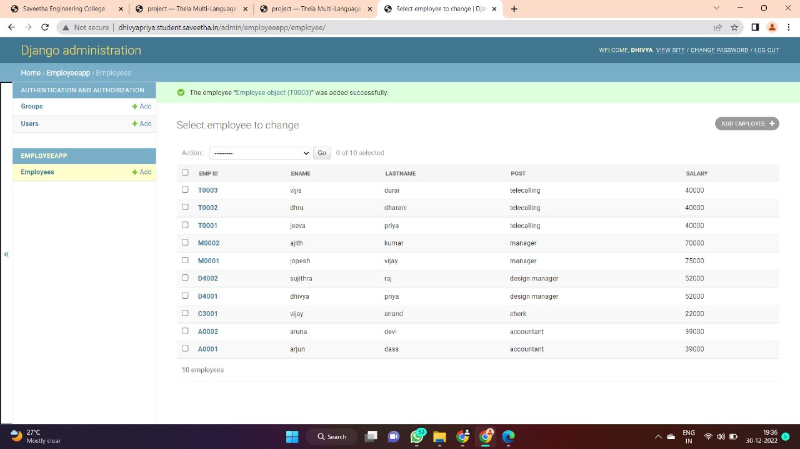
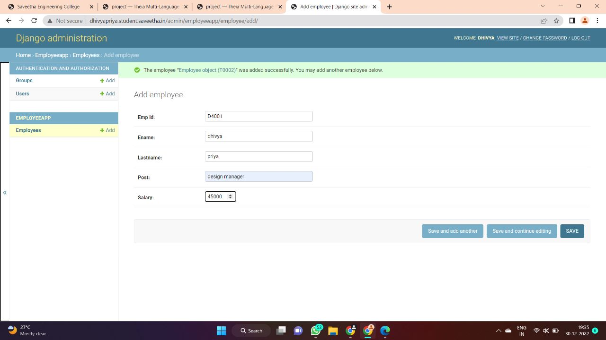

# Django ORM Web Application

## AIM
To develop a Django application to store and retrieve data from a database using Object Relational Mapping(ORM).

## Entity Relationship Diagram


## DESIGN STEPS

### STEP 1:
Create a new a new Django project using "django-admin startproject",get into the
project terminal and use "python3 manage.py startapp" command.

### STEP 2:
Define a model for the Employee details in the models.py . Allow host access and add
the app name under installed apps in settings.py

### STEP 3:
Register the models with the Django admin site.In admin.py under app folder,register
the models with Django admin site.

### STEP 4:
Run the python manage.py makemigrations and python manage.py migrate commands
to create the necessary database tables for the Employee details model.Run the server
using "python3 manage.py runserver 0:8000" command.


## PROGRAM
```
#IN models.py
from django.db import models
from django.contrib import admin
# Create your models here.
class Employee(models.Model):
emp_id=models.CharField(max_length=20,primary_key=True)
ename=models.CharField(max_length=20)
lastname=models.CharField(max_length=20)
post=models.CharField(max_length=20)
salary=models.IntegerField()
class EmployeeAdmin(admin.ModelAdmin):
list_display=('emp_id','ename','lastname','post','salary')
#IN admin.py
from django.contrib import admin
from .models import Employee,EmployeeAdmin
# Register your models here.
admin.site.register(Employee,EmployeeAdmin)
```

## OUTPUT





## RESULT
thus we develop a Django application to store and retrieve data from a database using Object Relational Mapping(ORM).